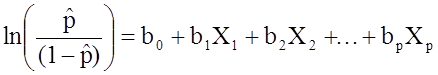

A collection of my codes for ML-based feature selection. This page includes:

* [Data imputation (Random Forest)](#data_imputation)
* [Multiple logistic regression (R base)](#logistic)
* [Multiple linear regression (LASSO)](#multiple_linear_regression)
* [Multivariate multiple linear regression (LASSO)](#multivariate_linear_regression)
* [LASSO stability selection](#stability_selection)
* [Calculate p-values for lasso selected features](#lasso_pvalues)
* [CCA (intend to include) / Sparse CCA](#cca)
* [SVM](#svm)
* [Random Forest](#random_forest)


Load libraries
```{r}
library(dplyr)
```


### <a id="data_imputation"></a>Data imputation 

Implement random forest for data imputation. Use "clinic_features" as an example.
```{r}
library(randomForest)

clinic_features <- read.table("data/clinic_features.csv", sep=",", header=TRUE, row.names=1, check.names=FALSE) # check.names=FALSE so colnames could start with numeric characters
clinic_features$outcome <- as.factor(clinic_features$outcome)  # Need to convert outcome to factors, otherwise regression would be made
print(paste0("The number of NA values: ", sum(is.na(clinic_features))))
head(clinic_features)
clinic_features.imputed <- randomForest::rfImpute(outcome ~., clinic_features)
```

OOB = out of bag error

From ?rfImpute:

The algorithm starts by imputing NAs using na.roughfix. Then randomForest is called with the completed data. The proximity matrix from the randomForest is used to update the imputation of the NAs. For continuous predictors, the imputed value is the weighted average of the non-missing obervations, where the weights are the proximities. For categorical predictors, the imputed value is the category with the largest average proximity. This process is iterated iter times.


Note: Imputation has not (yet) been implemented for the unsupervised case. Also, Breiman (2003) notes that the OOB estimate of error from randomForest tend to be optimistic when run on the data matrix with imputed values.


**I added:**
Random forest uses bootstrapped dataset for training a tree. Thus, each time when it selects and build a dataset, certain number of cases would be left out (out-of-bag), and thus the left-out data are collected and used for prediction. The OOB error is the error rate  during prediction using the built model. (Yes! rfImpute builds random forest models consecutively during each iteration. Default iteration = 5.) 


### <a id="logistic"></a>Multiple logistic regression

Logistic regression is used to obtain odds ratio of a variable/variables between two classifications. / Logistic regression reports odds ratio. 

<center>
{width=35%}
</center>


R base functions provide p-values. P-values probabily calculated from R^2 and F. 

Aim: To find clinic features that are related to prognosis
```{r}
# First scale
clinic_features.imputed[, which(colnames(clinic_features.imputed) != "outcome")] <- apply(clinic_features.imputed[, which(colnames(clinic_features.imputed) != "outcome")], 2, function(x) (x-mean(x))/(max(x)-min(x)))

# Multiple logistic regression
set.seed(728)

clinic_features.imputed$outcome <- sapply(clinic_features.imputed$outcome, function(x) as.numeric(as.character(x)))

clinic.logistic <- glm(outcome ~ ., data=clinic_features.imputed, family="binomial", singular.ok = TRUE)

summary(clinic.logistic)
```

Therefore, no significant clinic features had been selected using R base function glm(). 

2 warnings occur:

* Warning: glm.fit: algorithm did not converge (1)
* Warning: glm.fit: fitted probabilities numerically 0 or 1 occurred (2)


(1) Warning: glm.fit: algorithm did not converge

The predictor variable x is able to **perfectly separate** the response variable y into 0’s and 1’s.

To resolve this warning, use penalized regression, for example, lasso logistic regression and elastic-net regularization -> refer to **glment** package.


(2) Warning: glm.fit: fitted probabilities numerically 0 or 1 occured

The predicted values/probabilites are either 0 or 1. No "intermediate" values. It is okay to ignore it. 


Therefore, try glmnet
```{r}
outcome <- clinic_features.imputed[, "outcome", drop=FALSE]  # drop=FALSE to include rownames
clinic_features.imputed <- clinic_features.imputed[, -which(names(clinic_features.imputed)=="outcome")]

clinic.logistic <- glmnet::glmnet(y=as.matrix(outcome), x=as.matrix(clinic_features.imputed), alpha=1, family="binomial")  
# glmnet::glmnet requires input to be matrices

# Plot the hyperparameters
plot(clinic.logistic, xvar='lambda')

# Print the features that have non-zero coef
coef(clinic.logistic, s = glmnet::cv.glmnet(y=as.matrix(outcome), x=as.matrix(clinic_features.imputed))$lambda.1se)
```

Therefore, c13 has non-zero beta (although really really really small...). Thus, glmnet() binomial equivalent to glm() binomial. Besides, glmnet does not provide p-values. P-values have to be computed using other methods such as bootstrapping.  


### <a id="multiple_linear_regression"></a>Multiple linear regression (LASSO) 

### <a id="multivariate_linear_regression"></a>Multivariate multiple linear regression (LASSO) 

### <a id="stability_selection"></a>LASSO stability selection 

### <a id="lasso_pvalues"></a>Calculate p-values for lasso selected features 

### <a id="cca"></a>CCA (intend to include) / Sparse CCA 

### <a id="svm"></a>Support Vector Machine 

### <a id="random_forest"></a>Random Forest 


